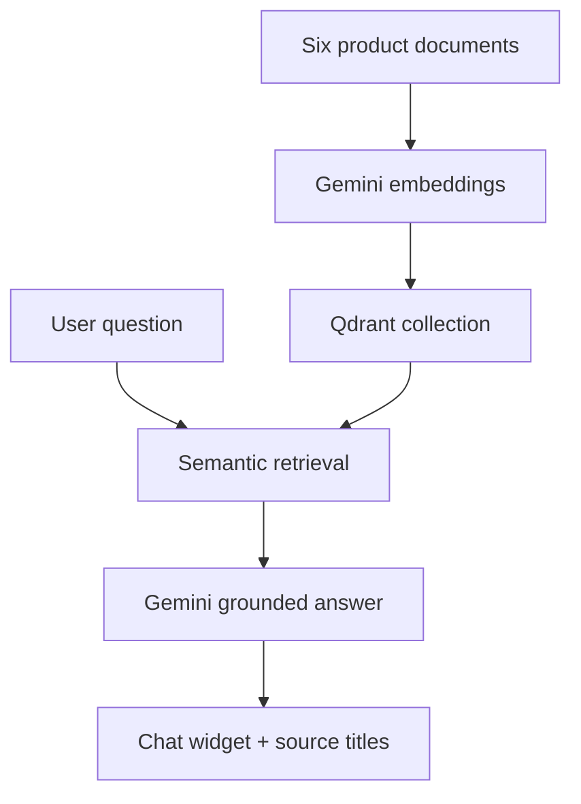
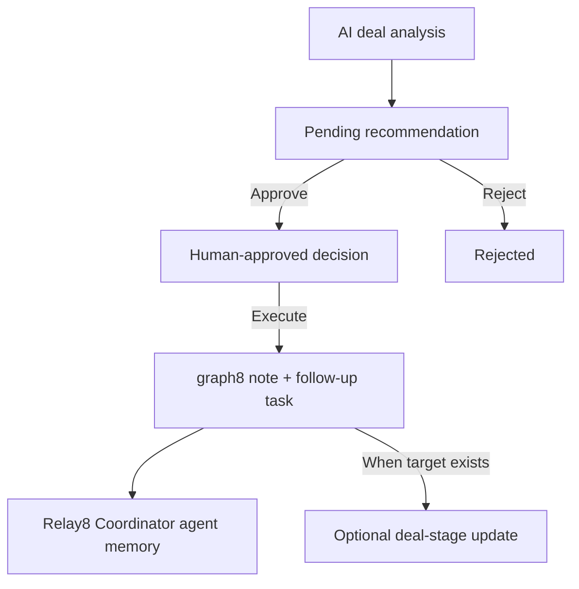
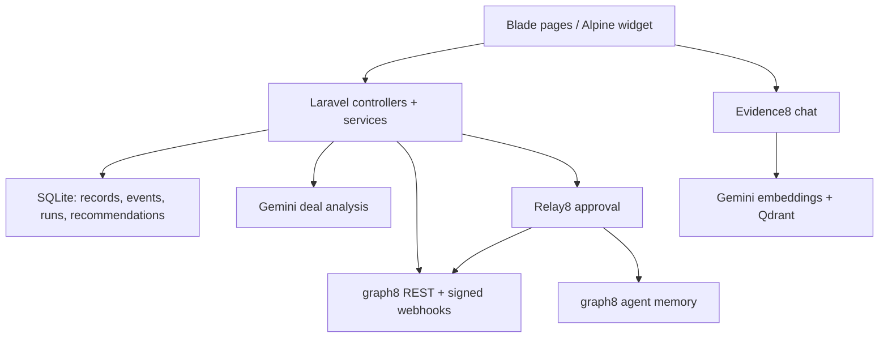

# RevenueNexus8

### The AI deal before the human deal

**RevenueNexus8** is an AI revenue decision Layer built for **graph8 Hackathon Lahore 2026**. It gives a sales team a **second-perspective AI layer** before a real buyer conversation: buyer-side questions, negotiation choices, historical deal signals, product evidence, and a recommended next move. A human approves an action before it is executed through graph8.

> Prepare the AI deal first; enter the human deal with a clearer strategy.


## The idea

A CRM records deal stages, contacts, companies, and activity. Before a call, the seller still has to decide what the information means: whose objections matter, which concession is safe, how to frame the proposal, and what to do next. RevenueNexus8 uses graph8 context and Gemini analysis to prepare that decision.

Three distinct contexts participate:

1. **Live revenue context** from graph8: companies, contacts, deals, events, and deal history.
2. **The seller's deal inputs:** solution, value, objections, negotiating terms, objective, or candidate strategy.
3. **Product knowledge:** six indexed RevenueNexus8 documentation items in a separate Qdrant collection, accessible through Evidence8 chat.

The analysis creates a recommendation. **Relay8 makes that recommendation a human-reviewed decision** before the app writes approved follow-up into graph8. This is the AI deal before the human deal: think through perspectives and trade-offs before talking to the buyer.

## Product flow

1. Sync graph8 companies, contacts, and deals to local records. Accept signed graph8 webhook events; TimeMachine8 can also fetch live deal history.
2. Choose a graph8 company/deal or enter the negotiation or historical-strategy question.
3. Run structured Gemini analysis through Boardroom8, Negotiator8, or TimeMachine8.
4. Save the input, result, status, optional score, timestamps, and pending recommendation in the application.
5. Ask Evidence8 about product details: Gemini embeds the question, Qdrant retrieves relevant product documentation, and Gemini answers with source titles.
6. Review and approve or reject the recommendation in Relay8.
7. Execute an approved recommendation to create a graph8 note and task; conditionally update a deal stage if the required target stage exists.
8. Forward the approved report from RevenueNexus8 to graph8's Relay8 Coordinator agent memory, providing persistent context for the decision.

## Boardroom8

**Purpose:** give the sales team a second perspective on a buyer committee before meeting it.

The user selects a graph8 company and optionally an existing deal, then supplies deal value, stage, proposed solution, and optional objections. The backend fetches the company's contacts from graph8 and requires at least one. If no existing deal was selected, it retrieves a sales pipeline and stage and creates a live graph8 deal; it requires a returned deal ID. The collected company, contacts, deal, solution, stage, and objection context goes into the AI analysis service.

A completed run stores its result and creates a **pending** Relay8 recommendation containing graph8 company/deal/contact IDs. Missing contacts or an unavailable pipeline produce a visible error rather than fabricated company data.

## Negotiator8

**Purpose:** prepare a negotiation before the human negotiation.

Inputs are buyer name, proposed price, minimum acceptable price, buyer message, objective, and a **3-, 5-, or 7-round** setting. Validation requires the proposed price to be at least the minimum. The Gemini analysis returns negotiation insights and a recommended move; a completed run stores its result and a pending recommendation.

The module helps consider buyer pushback, price, terms, concessions, and the next move. It **does not itself send an offer to a buyer**.

## TimeMachine8

**Purpose:** examine a candidate strategy against recorded deal history.

TimeMachine8 fetches graph8 deal history and snapshots, storing event records. The user chooses a **30-, 90-, 180-, or 365-day** window, an event type, and a candidate strategy. The backend selects up to **100** events in chronological order and analyzes the proposal against them. It stores the result and a pending recommendation with event and graph8 identifiers; completed events are marked processed.

If there are no matching events, it reports that condition. Historical records provide context for a decision; the app does not rewrite past graph8 activity.

## Evidence8 RAG chatbot

Evidence8 answers questions about RevenueNexus8 using a **retrieval-augmented generation** knowledge layer from Qdrant. Its six indexed documents cover Platform Overview, Boardroom8, Negotiator8, TimeMachine8, Relay8 approval/graph8 execution, and Evidence8 itself.



The recorded implementation includes `GeminiEmbeddingService` using `gemini-embedding-001` with **768-dimensional** vectors; `QdrantService` for collection creation, upsert, and search; `RevenueKnowledgeService`; the `IndexRevenueKnowledge` command; `EvidenceChatController`; and a floating Alpine chat widget. The recorded collection name is `revenue_nexus_knowledge`, with `gemini-3.1-flash-lite` as the configured chat model. The chat endpoint was recorded as `/evidence8/chat`.

**Strict corpus boundary:** Qdrant holds product documentation for Evidence8. It does **not** index graph8 customer companies, contacts, deals, events, analyses, or recommendations. Revenue context for the other modules comes through graph8 and the application database.

## Relay8 and the graph8 agent

Relay8 is the human approval and outbound-action layer. It shows the signed-in user's recommendations and counts pending, approved, and executed states.



A pending recommendation can be approved. A pending or approved recommendation can be rejected. **Only an approved recommendation can be executed.** Approval stores `approved_by` and `approved_at`; execution stores `executed_at`, the provider response, or an error. Ownership is checked against the signed-in user.

The recorded `Graph8Service::executeRecommendation()` builds a graph8 note headed **“RevenueNexus8 Approved Recommendation”** with action, description, source module, recommendation ID, and a structured dynamic payload. It creates the **note first, task second**, and updates a deal stage only if a suitable target stage is supplied.

### The Coordinator handoff

Relay8 also forwards the **approved decision report from our app to the graph8 Relay8 Coordinator agent's persistent memory**. This is a real integration result, not just an internal card: on **27 September 2026**, report delivery for recommendation **14** used session `revenuenexus8-recommendation-14`; graph8 returned **“Memory updated successfully”**, and its Activity page showed approved-decision-report entries. The observed summary included negotiation terms, pilot/workshops, concessions, and human review.

A direct agent chat call returned 502 in that integration attempt, so the demonstrated working handoff uses the **agent memory endpoint**. Memory receipt establishes that graph8 got the approved report; it does not imply autonomous customer outreach by the agent.

## Architecture



**Inbound graph8 path:** `Graph8SyncController` fetches companies, contacts, and deals and saves local `Graph8Record` data. `Graph8WebhookController` verifies HMAC-SHA256 signatures and stores `Graph8Event` payloads, event type, time, and available entity IDs. TimeMachine8 additionally reads deal history and snapshots.

**Analysis path:** module controllers validate forms and call `RevenueSimulationService` for structured Gemini output. The application stores input/result/status/score in the `Simulation` model and creates a linked `Recommendation`. The code identifier `Simulation` is used here for accuracy; the product's user-facing value is AI deal preparation and a second perspective.

**Outbound path:** `RelayController` enforces user ownership and recommendation state; `Graph8Service` writes approved actions to graph8. The separately demonstrated Coordinator memory handoff supplies the approved report to a graph8 agent.

**Presentation:** Blade views for the landing/authentication pages, dashboard, Boardroom8, Negotiator8, TimeMachine8, and Relay8; Tailwind CSS, Alpine.js, Three.js, JavaScript scene components, and Vite assets. The dashboard displays local counts and graph8 event activity.

### Recorded application components

| Component | Responsibility |
| --- | --- |
| `Graph8Service` | Graph8 API access and approved recommendation execution. |
| `Graph8SyncController` | Sync company, contact, and deal records. |
| `Graph8WebhookController` | Verify signature and ingest events. |
| `RevenueSimulationService` | Gemini analysis for the three deal modules. |
| `BoardroomController` | Prepare graph8 deal context and record result. |
| `NegotiatorController` | Validate negotiation inputs and record result. |
| `TimeMachineController` | Fetch history, select events, record strategy analysis. |
| `RelayController` | Approve, reject, and execute user-owned recommendations. |
| `GeminiEmbeddingService` | Generate product-document/query embeddings. |
| `QdrantService` | Maintain and query the product knowledge collection. |
| `RevenueKnowledgeService` | Supply RevenueNexus8 product knowledge. |
| `IndexRevenueKnowledge`, `EvidenceChatController` | Index documents and serve RAG chat. |
| `Graph8Record`, `Graph8Event`, `Simulation`, `Recommendation` | Recorded application models. |

### Recorded HTTP routes

| Route | Function |
| --- | --- |
| `/`, `/dashboard` | Landing page and authenticated dashboard. |
| `POST /graph8/sync` | Sync graph8 company/contact/deal data. |
| `POST /webhooks/graph8` | Receive signed graph8 events. |
| `GET, POST /boardroom8` | View and submit buyer-side deal analysis. |
| `GET, POST /negotiator8` | View and submit negotiation analysis. |
| `GET, POST /time-machine8` | View and submit historical strategy analysis. |
| `GET /relay8` | See recommendation queue. |
| `PATCH /relay8/{recommendation}/approve` | Approve a pending recommendation. |
| `PATCH /relay8/{recommendation}/reject` | Reject an eligible recommendation. |
| `POST /relay8/{recommendation}/execute` | Execute an approved recommendation. |
| `/evidence8/chat` | Later recorded Evidence8 chat endpoint. |

The route archive predates Evidence8; inspect the latest checkout for its exact HTTP method/middleware and other newly added routes.

## Technology stack

| Layer | Technologies | Role |
| --- | --- | --- |
| Backend | **Laravel 13, PHP 8.4** | Routes, authentication, validation, services, tests. |
| Database | **SQLite and Qdrant** | Records, events, analysis runs, recommendations, users. |
| UI | **Blade, Tailwind CSS, Alpine.js** | Module pages, dashboard, interactive widget. |
| Visual/build | **Three.js, JavaScript, Vite** | Cinematic scene and frontend bundle. |
| AI analysis | **Gemini** | Structured deal, buyer-side, and negotiation results. |
| RAG | **Gemini embeddings + Qdrant + Gemini chat** | Product documentation retrieval and grounded answers. |
| Revenue integration | **graph8 REST, webhooks, agent memory** | Live context, approved actions, agent report delivery. |

The recorded application is a Laravel app. It does not require describing an unverified Python backend, n8n workflow, or customer-data vector store.

## Graph8 data and actions

| Direction | Data / action | Recorded behavior |
| --- | --- | --- |
| graph8 → app | Companies, contacts, deals | Explicit sync stores graph8 IDs, names, payloads, and sync time. |
| graph8 → app | Signed webhook events | Event type, IDs, payload, timestamp stored after signature verification. |
| graph8 → app | Deal history/snapshots | TimeMachine8 fetches and records events for its analysis. |
| app → graph8 | New deal | Boardroom8 can create one with pipeline, stage, contacts, amount, and description. |
| app → graph8 | Approved recommendation | Create note and task; optionally change deal stage. |
| app → graph8 agent | Approved report | Coordinator memory persists a report and shows Activity entries. |

The recorded API base URL was `https://be.graph8.com/api/v1`. Config uses `GRAPH8_BASE_URL`, `GRAPH8_API_TOKEN`, optional authorization header/scheme and timeout. HTTP requests are JSON with retry. Valid credentials and reachable graph8 services are needed for live features.

## Security and data boundaries

- Module routes require authentication; the recorded dashboard route also requires verified authentication.
- User analyses and Relay8 recommendations are scoped to that user. Relay8 verifies ownership on actions.
- Graph8 webhook POSTs require a configured HMAC-SHA256 secret and a valid signature. Invalid or missing signatures are rejected.
- A recommendation must be human-approved before explicit graph8 execution.
- Failure is recorded on an analysis/recommendation rather than presented as success.
- Evidence8's six documents contain **product knowledge**, not customer CRM data.
- Keep graph8, Gemini, Qdrant, and webhook credentials in local environment settings; do not commit `.env`.

## Local setup

Requirements: **PHP 8.4**, Composer, Node.js/npm, and credentials for any external service you intend to use.

```bash
composer install
cp .env.example .env
php artisan key:generate
php artisan migrate
npm install
```

On PowerShell use `Copy-Item .env.example .env` for the copy step. Set the exact environment variables provided in the **current checkout's** `.env.example`, including database, Gemini, Qdrant, graph8 API/webhook, and Coordinator configuration as applicable. Do not invent or commit credentials.

Run Laravel and Vite in separate terminals:

```bash
php artisan serve
npm run dev
```

Sign in, sync graph8, and open the module pages. Evidence8 needs the product knowledge indexed through the project's `IndexRevenueKnowledge` command; check the current registered Artisan command signature before running it.

```bash
npm run build
php artisan test
```

These build frontend assets and run Laravel tests. External calls also need valid provider accounts and network access.

## Verified checkpoint

At the recorded **27 September 2026** local checkpoint:

- **25 tests / 61 assertions passed**; Vite production build passed.
- **Six RevenueNexus8 product documents** were indexed in Qdrant.
- A Relay8 approved report reached graph8 **Coordinator agent memory** and appeared in graph8 Activity.
- Local commit `28ef122` was recorded.

These observations do not certify the contents of any later GitHub push or a live deployment. The earlier frontend archive still contained **RevenueTwin8** labels, and a bulk PowerShell rebrand attempt failed because of duplicate replacement keys. Inspect the current checkout before claiming every UI label has been updated. The repository created for this project is [RevenueNexus8-Graph8-Hackathon](https://github.com/muhammadzayed2003/RevenueNexus8-Graph8-Hackathon).

**Scope:** Evidence8 is product-doc RAG rather than CRM-wide RAG. Agent-memory receipt is a delivered approved report, not proof of autonomous buyer outreach. The graph8 deal-stage update is conditional. Human approval precedes explicit execution.

## Author

**Muhammad Zayed Bin Gul Nawaz**  
graph8 Hackathon Lahore 2026
